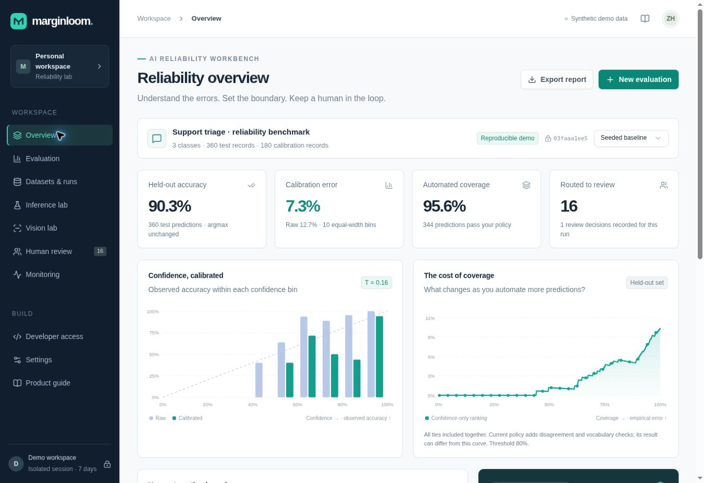
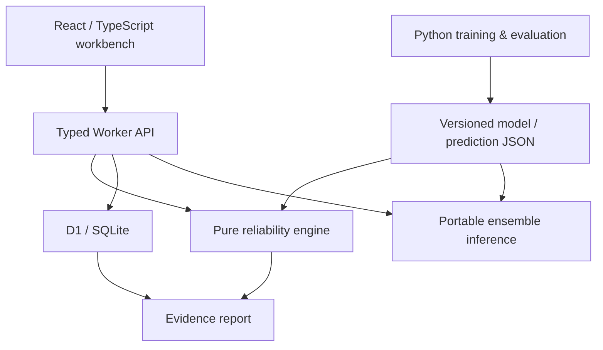

<div align="center">

# Marginloom

### Evidence for when your model should defer.

A working AI reliability workbench: **predictions → calibration → decision policy → human review → reproducible report**.

[Quick start](#run-in-one-command) · [Walkthrough](docs/product.md) · [Architecture](docs/architecture.md) · [Measured results](#measured-results-not-production-claims) · [Verification](docs/testing.md)

</div>



A model can be accurate and still be confidently wrong. Marginloom helps an applied AI team inspect that gap, decide which predictions deserve human attention, and retain the evidence behind the decision.

This is an executable research-and-engineering portfolio, developed with AI assistance. It contains real trained baseline models, actual computed metrics, server-side persistence and tested authorization boundaries. It has **no paid model API dependency, invented customers or fabricated benchmark results**.

## Run in one command

From the repository root, with Docker Engine and Compose v2 installed:

```bash
docker compose up --build
```

Open **http://localhost:3000**. The app creates an isolated demo workspace. SQLite data persists in the named Docker volume; no account, database server or commercial key is required.

**Validation note:** the Worker build, actual browser demo and local D1 integration suite were executed. Docker is unavailable in the authoring environment, so a dedicated CI job is supplied to verify the container after push; it is not claimed as locally verified. See [verification](docs/testing.md).

For development, use Node **24**, pnpm **11.25.0** and Python **3.12**:

```bash
corepack enable
corepack pnpm install --frozen-lockfile
make dev
# http://localhost:3000
```

Python is only needed to retrain/reproduce the experiments:

```bash
python -m venv .venv
. .venv/bin/activate
pip install -r requirements.txt
make reproduce
```

## A five-minute tour

1. **Overview:** inspect the 360 held-out predictions and calibration diagram.
2. **Move the confidence threshold:** see accepted error and human-review workload recompute from actual records. At 100%, no record passes; risk is correctly shown as unavailable.
3. **Evaluation:** inspect slices and the confusion matrix. Notice that calibration improves ECE while worsening test log loss.
4. **Inference lab:** run a support message through the trained local ensemble. Try unfamiliar vocabulary or misleading quoted context.
5. **Human review:** record a correction with a note. Original benchmark labels remain unchanged.
6. **Datasets & runs:** import the downloadable prediction bundle, then save a policy snapshot.
7. **Export report:** obtain metrics, policy, provenance, record decisions and review evidence as JSON.
8. **Vision lab:** inspect synthetic micrographs, ground truth, learned masks and pixel entropy. This companion experiment is precomputed, with its own report.

## What is implemented

| Surface            | Actual behavior                                                                                                                                                 |
| ------------------ | --------------------------------------------------------------------------------------------------------------------------------------------------------------- |
| Evaluation engine  | Positive temperature scaling fitted only on calibration data; untouched-test ECE, Brier, NLL, accuracy, macro F1, macro OvR AUROC and confusion matrices        |
| Policy exploration | Confidence threshold, ensemble Jensen–Shannon disagreement and lexical novelty; tied confidence risk–coverage; empty-set handling and descriptive Wilson bounds |
| Data workflow      | Validated JSON prediction imports, SHA-256 content identity, immutable evaluation/policy snapshots and slice analysis                                           |
| Inference          | Three trained logistic models, binary token features, exported weights, calibrated probabilities and token-logit contributions                                  |
| Human review       | Workspace-scoped persisted dispositions and notes, separate from evaluation labels                                                                              |
| Evidence export    | Current visible policy, source data, metrics, record-level routing and human reviews                                                                            |
| Backend            | Typed REST handlers, D1/SQLite migrations, prepared SQL, sessions, API-key rotation, rate/size/run limits and audit records                                     |
| Monitoring         | Actual workspace events and descriptive distribution comparisons; no invented production traffic                                                                |
| Vision companion   | Reproducible synthetic segmentation, image-disjoint training/tuning/test splits, per-image Dice/IoU and uncertainty inspection                                  |

## Architecture



A modular monolith keeps the complete demo inexpensive to run. The statistical engine is independent of the UI and database. Python trains/reproduces the experiments; portable coefficients support online inference in the same backend, without a second model-serving service.

**Stack:** React 19, TypeScript, Next-compatible App Router on Vinext/Vite, Tailwind, accessible Radix/shadcn primitives, Cloudflare Workers, D1/SQLite, Drizzle migrations, Zod, Python, NumPy, SciPy, scikit-learn, Docker and GitHub Actions. Vinext is a beta dependency; that deployment trade-off is documented in [ADR 001](docs/decisions/001-runtime.md).

## Measured results, not production claims

The text data is entirely author-generated and MIT-licensed. There are **720 training**, **180 calibration** and **360 test** records, with sentence-template families assigned to disjoint splits before generation. All five stress slices occur in each split. Vocabulary fitting and bootstrap training use only training data.

| Held-out metric                    | Raw ensemble | Temperature-scaled |
| ---------------------------------- | -----------: | -----------------: |
| Accuracy                           |       90.28% |             90.28% |
| Macro F1                           |       0.9022 |             0.9022 |
| ECE, 10 equal-width bins           |       0.1267 |             0.0726 |
| Multiclass Brier, sum over classes |       0.1775 |             0.1620 |
| Log loss / NLL                     |   **0.3256** | **0.3816 — worse** |

Fitted temperature: **0.1606**. Temperature scaling preserves argmax labels; it does not guarantee improvement on unseen data. The worsening NLL is retained as a useful failure case.

The default exploratory policy (confidence ≥ 0.80, disagreement ≤ 0.12 nats, lexical novelty ≤ 0.65) accepts **344/360** predictions and routes **16** for review. It still accepts **28 errors**, an empirical accepted error rate of **8.14%**. This is evidence to inspect a policy, not a claim it is safe to release.

The separate synthetic segmentation experiment uses **40 training / 10 threshold-tuning / 10 test images**. Actual mean test Dice is **0.9562** and mean IoU **0.9165**. Pixel uncertainty is not whole-mask confidence. These are generated geometric objects, not clinical samples.

Reproduce: `make reproduce`. Inspect [machine-readable evaluation](docs/reports/benchmark.json), [Python experiment outputs](ml/artifacts/metrics.json), [model provenance](data/metadata.json), and [limitations](docs/reliability.md).

## API example

Generate a scoped API key in **Developer access**, then:

```bash
export MARGINLOOM_URL=http://localhost:3000
# Set MARGINLOOM_KEY privately; never commit it.
curl "$MARGINLOOM_URL/api/evaluate" \
  -H "Authorization: Bearer $MARGINLOOM_KEY" \
  -H 'Content-Type: application/json' \
  --data-binary @data/demo.json
```

See [API contracts](docs/api.md). The format accepts model logits from your own PyTorch/Transformer/scikit-learn pipeline; the demo does not claim to include a Swin checkpoint or an LLM.

## Repository map

| Path               | Responsibility                                                                    |
| ------------------ | --------------------------------------------------------------------------------- |
| `app/`             | Product interface and REST routes                                                 |
| `lib/reliability/` | Pure metrics, calibration, policy, drift and portable inference                   |
| `lib/server.ts`    | Database boundary, sessions, CSRF, limits and response handling                   |
| `db/`, `drizzle/`  | Schema, indexes, migrations and atomic workspace run quota                        |
| `ml/`              | Deterministic training, independent Python metrics, parity fixtures, segmentation |
| `data/`            | Small committed model and evaluation exports                                      |
| `public/vision/`   | Generated scientific inspection assets                                            |
| `tests/`           | Statistical, parity and API integration checks                                    |
| `scripts/`         | Local migrations, model export, report generation and integration runner          |
| `docs/`            | Product, market research, design decisions, security and verification             |

## Quality gates

```bash
make test         # TypeScript statistics/parity + Python tests
make lint
make typecheck
make integration  # build, then real Worker + local D1 API checks
```

The API suite checks session isolation, unauthorized access, CSRF, cross-origin writes, data leakage, persistence, policy/report consistency, correction validation, key rotation and audit evidence. Browser checks cover the real demo flow and mobile/laptop layouts. [Verification details](docs/testing.md) separate executed checks from pending hosted CI/container checks.

## Deployment and security

- **Local demo:** one container, local Worker runtime and persistent SQLite. Binds localhost by default.
- **Hosted:** Workers-compatible ESM with D1 migrations. A private hosted preview is protected by the platform; browser workspaces remain isolated within it.
- **Production adoption:** add durable recoverable accounts, team membership/RBAC, retention and backups, abuse-resistant ingress and an independently validated dataset/policy process.

Demo authentication is a random capability cookie, not password-based user management. Keys are stored hashed. Mutations use prepared SQL, workspace scope and server validation. Credentials and raw inference text are not logged. See [security](docs/security.md) and [deployment](docs/deployment.md).

## Why this project

Employer evidence favors the ability to ship and operate full-stack AI systems, reproduce evaluations, understand failures and incorporate human feedback. Marginloom combines those capabilities with calibration, uncertainty and segmentation research. The market is crowded: Phoenix, Langfuse, Evidently, Cleanlab and FiftyOne already solve related problems. The contribution here is an inspectable end-to-end implementation, not a claim to invent the category. Read the dated [market research](docs/market-research.md).

## Next five directions

1. Evaluate consented or licensed real datasets and integrate a trained vision/Transformer adapter.
2. Add a separate policy-validation split, locked release gates and grouped uncertainty intervals.
3. Add recoverable accounts, team roles, configurable retention and backup operations.
4. Add durable evaluation jobs and object storage for larger datasets.
5. Connect ongoing labeled feedback and multimodal/RAG adapters to the same evidence format.

See [roadmap](docs/roadmap.md), [contribution guidance](CONTRIBUTING.md) and [changelog](CHANGELOG.md).

**License:** MIT for first-party code, generated data and model exports. Vendored infrastructure/components retain their upstream license notices; see [third-party notices](docs/third-party-notices.md).
