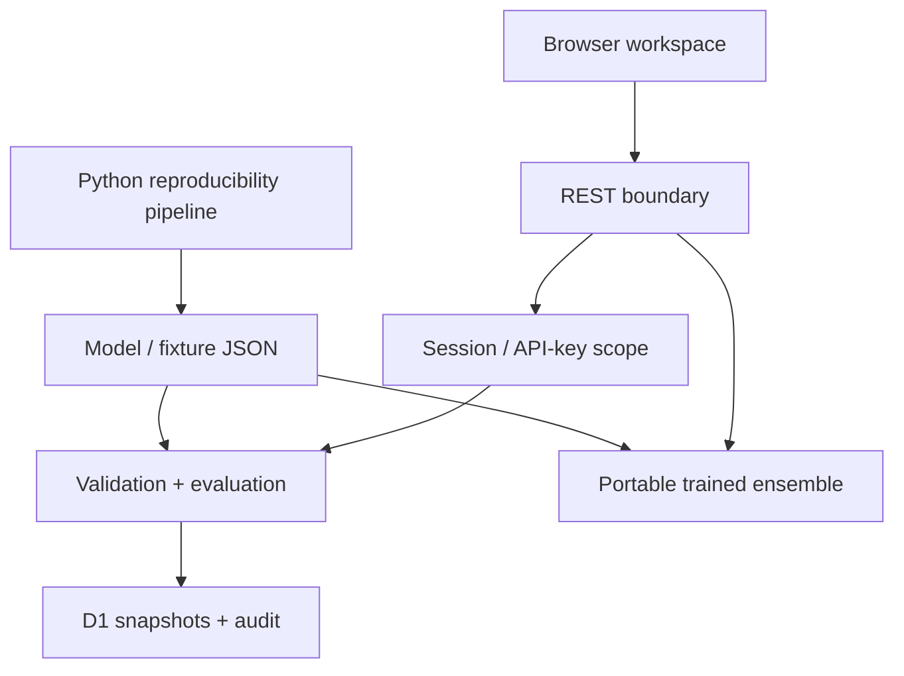

# Architecture

Marginloom is a modular monolith. Browser interactions call one Worker API; deterministic calculations live in a pure TypeScript module; D1 stores workspace records. Python is an offline training and independent evaluation environment, not a required always-on service.

## Boundaries

- `lib/reliability/engine.ts` owns formulas and has no network or storage side effects.
- `lib/server.ts` owns token hashing, workspace identity, CSRF, payload bounds and database access.
- API routes validate and compose operations. Database mutations and audit records share transactions where losing audit evidence would make a write ambiguous.
- UI policy exploration is recomputed locally from the same engine. Exports ask the server to recompute the visible policy, avoiding stale reports.
- Python and TypeScript are checked against independent numeric fixtures. Small model exports are committed; no large weight download is needed.

## Deliberate limits

The web workflow handles multiclass predictions; the vision companion is a separate precomputed research inspection, with its own report. No vision upload/online segmentation queue is claimed. Evaluations are bounded synchronous work (2,000 records, 12 classes, 50 slices). Larger jobs require a durable queue and object storage, not an unbounded request handler.

See the decision records for why SQLite, a single service and a lexical baseline were chosen.
