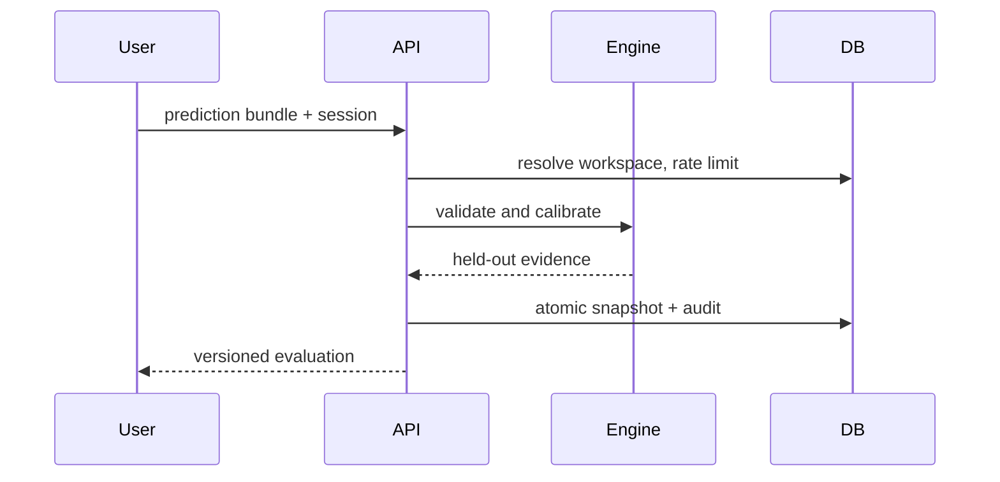

# System design

## Main request path

The API checks identity before accessing user records. Foreign-run IDs return 404. Dataset IDs are content SHA-256 values; run IDs are random UUIDs so different policies can refer to the same input.

## Resource and failure behavior

- Request body is read incrementally and cancelled above 900,000 bytes.
- 20–2,000 rows, 2–12 classes, 50 slices and a 1.5 MB serialized evaluation cap constrain CPU/memory/D1 rows.
- Fixed-window D1 counters limit each workspace to 120 requests/minute and evaluation imports to 8/minute. Session creation has a 20/minute ingress-IP limit. A non-Cloudflare local deployment uses the shared `local` bucket.
- An SQLite trigger enforces at most 30 runs/workspace atomically, including simultaneous writes.
- Failed storage requests return a recoverable error and request ID. The UI keeps import text and notes until success.
- Rate counters and expired sessions are cleaned using indexed expiry predicates. Workspace data currently remains until the deployment operator removes it; automatic retention/backup is a documented gap.

No online external-model dependency, vector database or second inference service is needed. Metrics/report computation is deterministic. The built runtime is approximately the size reported by its build output; no production throughput/SLA is asserted.

## Scaling path

Move large inputs to object storage, enqueue jobs with content hashes and idempotency keys, persist job states, and keep the pure engine interface. Add tenant membership before collaborative workspaces. Avoid copying entire run payloads for every policy once dataset sizes justify normalization.
